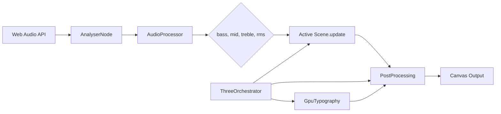

# Architecture Overview

## Render Pipeline



---

## Core Components

### AudioProcessor

**File**: `src/audio/AudioProcessor.ts`

Extracts frequency bands from Web Audio API's `AnalyserNode`:

| Band | FFT Range | Musical Purpose |
|------|-----------|----------------|
| **Bass** | 0–⅓ bins | Kick drums, sub-bass → drives camera/scale |
| **Mid** | ⅓–⅔ bins | Vocals, melody → secondary deformations |
| **Treble** | ⅔–end bins | Hi-hats, cymbals → edge glow, detail |
| **RMS** | Time-domain | Overall loudness → bloom, fog, flash |

**Smoothing**: Exponential moving average with factor `0.82`:
$$\text{value}_t = \text{prev} \times 0.82 + \text{raw} \times 0.18$$

---

### ThreeOrchestrator

**File**: `src/core/ThreeOrchestrator.ts`

Master controller responsible for:

1. **WebGL Renderer** — `antialias: true`, dynamic pixel ratio, transparent canvas
2. **Scene Management** — Array of 19 scenes, `switchScene(index)` method
3. **Render Loop** — `requestAnimationFrame`, calculates delta time
4. **Resize Handling** — Resolution scale factor (0.5–2.0) for performance
5. **Palette Distribution** — Propagates color palettes to all scenes via `setPalette()`
6. **Zen Mode** — Hides UI, fullscreen immersion

#### Scene Array (indices)

| Index | Scene | Type |
|-------|-------|------|
| 0 | Lava Flow | Fullscreen |
| 1 | Julia Set 4D | Fullscreen |
| 2 | Lorenz Attractor | GPGPU |
| 3 | Riemann Sphere | 3D Mesh |
| 4 | Reaction-Diffusion | GPGPU |
| 5 | Hyperbolic Tiling | Fullscreen |
| 6 | Living Canvas | GPGPU |
| 7 | Fractal Infinity | Fullscreen |
| 8 | Terrain Biome | Fullscreen |
| 9 | Biopunk Ocean | Fullscreen |
| 10 | Void Archipelago | Fullscreen |
| 11 | Saturn Discs | Fullscreen |
| 12 | Soap Bubbles | Fullscreen |
| 13 | Fractal Unfold | Fullscreen |
| 14 | Infinite Cavern | Fullscreen |
| 15 | Spongy Tunnel | Fullscreen |
| 16 | Fractal Optic Fibre | Fullscreen |
| 17 | Mood Fractal | Fullscreen |
| 18 | Aethelgard | Fullscreen |

---

### PostProcessing

**File**: `src/core/PostProcessing.ts`

Effect chain using Three.js `EffectComposer`:

```
RenderPass → UnrealBloomPass → GaussianBlurPass → TextRenderPass (Layer 1)
```

- **UnrealBloom**: Strength driven by `u_rms`, creates cinematic glow
- **GaussianBlur**: Subtle depth-of-field effect
- **Text Layer**: Rendered on Layer 1 (after blur) to keep typography sharp

---

### GpuTypography

**File**: `src/core/GpuTypography.ts`

Uses `troika-three-text` for GPU-accelerated text rendering:
- Track title, artist name displayed as 3D text objects
- Rendered on Layer 1 → not affected by bloom/blur
- Positioned relative to orthographic camera

---

## Scene Architecture

### BaseScene (Abstract)

```typescript
abstract class BaseScene {
  scene: THREE.Scene;
  camera: THREE.Camera;
  
  abstract update(audio: AudioData, time: number): void;
  abstract resize(w: number, h: number): void;
  abstract dispose(): void;
}
```

### Scene Types

#### 1. Fullscreen Quad Scenes
Most scenes render a single fullscreen quad with a fragment shader:
- `OrthographicCamera(-1, 1, 1, -1, 0, 1)`
- `PlaneGeometry(2, 2)` with `ShaderMaterial`
- All computation happens in the fragment shader (raymarching)

#### 2. GPGPU Scenes
Lorenz, ReactionDiffusion, LivingCanvas use ping-pong render targets:
- Two `WebGLRenderTarget` instances swapped each frame
- Simulation shader reads texture A → writes texture B
- Display shader renders the result

#### 3. 3D Mesh Scenes
Riemann uses actual geometry with vertex displacement:
- `IcosahedronGeometry` or `SphereGeometry`
- Vertex shader reads frequency data from a `DataTexture`
- Fragment shader applies Blinn-Phong lighting

---

## Uniform Contract

All fullscreen shaders receive these uniforms:

| Uniform | Type | Description |
|---------|------|-------------|
| `u_time` | float | Elapsed time in seconds |
| `u_bass` | float | Low frequency energy [0–1] |
| `u_mid` | float | Mid frequency energy [0–1] |
| `u_treble` | float | High frequency energy [0–1] |
| `u_rms` | float | Overall loudness [0–1] |
| `u_resolution` | vec2 | Canvas size in pixels (× devicePixelRatio) |
| `u_colors` | vec3[3] | RGB palette (background, primary, accent) |
| `u_debug` | bool | Show color palette markers |

