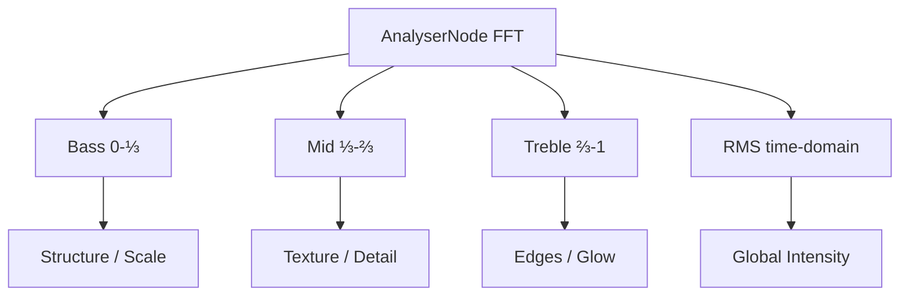

# Audio-to-Geometry Mapping

> How sound frequencies physically transform mathematical structures

---

## Frequency Band Roles



---

## Bass (Low Frequencies: 20–300 Hz)

**Role**: The "physical force" — pushes, expands, and deforms large-scale geometry.

| Shader | Parameter | Effect |
|--------|-----------|--------|
| `infinite_cavern` | Shell offset | Fractal shells expand outward |
| `spongy_tunnel` | Node growth X | Sponge nodes extend toward center |
| `fractal_optic_fibre` | `nodeGrowth.x × 0.8` | Fibres protrude deeper |
| `fractal_infinity` | `explodeForce` | Symmetry planes separate |
| `lavaflow` | Warp amplitude | Stronger fluid distortion |
| `lorenz_sim` | ρ parameter (+bass×20) | Attractor chaos increases |
| Camera systems | Speed boost | `u_time * speed + u_bass * N` |
| Tunnel shaders | `cavernRadius + u_bass` | Tunnel walls breathe |

**Design Principle**: Bass = macro-level transformation. On every kick drum, the world itself expands.

---

## Mid (Middle Frequencies: 300–2000 Hz)

**Role**: Secondary deformations — adds variation without overwhelming the structure.

| Shader | Parameter | Effect |
|--------|-----------|--------|
| `fractal_optic_fibre` | `nodeGrowth.y × 0.5` | Y-axis fibre density |
| `spongy_tunnel` | `rot(0.5 + u_mid * 0.2)` | Fold angle variation |
| `infinite_cavern` | Surface color mix | Shifts palette blend factor |
| `reaction_diff` | Feed rate modulation | Pattern density shifts |
| `terrain_biome` | Surface displacement | Terrain roughness |

**Design Principle**: Mid = texture quality. Vocals and melodies make surfaces more interesting without breaking form.

---

## Treble (High Frequencies: 2000–20000 Hz)

**Role**: Sharp details, edge effects, and visual "sparkle".

| Shader | Parameter | Effect |
|--------|-----------|--------|
| `infinite_cavern` | Sphere fold `k` | More aggressive inversion = sharper detail |
| `spongy_tunnel` | `nodeGrowth.z × 0.4` | Z-axis growth refinement |
| `fractal_optic_fibre` | `nodeGrowth.z × 0.4` | Fibre Z-extension |
| `lorenz_sim` | `dt` scaling | Faster attractor evolution |
| `reaction_diff` | Kill rate `k` | Sharper pattern edges |
| `hyperbolic` | Edge glow | Tile boundaries illuminate |
| `terrain_biome` | Fresnel intensity | Edge glow strength |

**Design Principle**: Treble = precision. Hi-hats and cymbals create crisp visual definition.

---

## RMS (Overall Loudness)

**Role**: Global intensity multiplier — affects everything simultaneously.

| Shader | Parameter | Effect |
|--------|-----------|--------|
| PostProcessing | Bloom strength | Overall scene glow |
| `fractal_optic_fibre` | Sphere fold `k` | Structure instability |
| `spongy_tunnel` | `nodeGrowth.y` | Node density |
| All tunnels | Camera speed | `+ u_rms * N` acceleration |
| `infinite_cavern` | Lightning flashes | `pow(u_rms, 3.0)` sparks |
| `living_canvas` | Feedback intensity | Trail persistence |
| Fog systems | Fog penetration | Louder = see further |

**Design Principle**: RMS = energy level. Quiet sections are dark and mysterious; loud sections are bright and overwhelming.

---

## The Smoothing Problem

Raw FFT values are noisy (change every frame). We smooth with exponential moving average:

$$\text{smoothed}_t = \text{prev} \times 0.82 + \text{raw} \times 0.18$$

- **Factor 0.82**: Responsive enough for beat detection, smooth enough to prevent flickering
- Higher factor (0.95) = laggy but smooth
- Lower factor (0.5) = instant but jittery

---

## Procedural World Generation

The visualizer uses **Deterministic Chaos** — the world appears random but is fully determined by:

$$\text{state}(t) = f(u\_time, u\_bass, u\_mid, u\_treble, u\_rms)$$

This means:
- Same track produces same visualization every time
- No randomness — only mathematical functions of time and audio
- System is reproducible and deterministic

---

## Cellular Morphing

Each spatial "cell" in infinite space has a unique mathematical descriptor:

```glsl
vec3 cell = floor(p / cellSize);
float descriptor = hash(cell); // Unique per cell
```

The descriptor controls:
- Whether geometry exists in that cell
- Scale/rotation of geometry
- Color variation within the palette

This makes the world feel infinitely varied while being computationally cheap (one hash per cell).

---

## Frequency → Parameter Guidelines

When adding new audio-reactive parameters:

1. **Bass** should control things that "feel heavy" — scale, position, force
2. **Mid** should control things that "feel alive" — rotation, blend, texture
3. **Treble** should control things that "feel sharp" — edges, detail, sparkle
4. **RMS** should control things that "feel loud" — glow, speed, intensity

**Safe ranges** (avoid values that break geometry):
```glsl
// Good: bounded, won't cause NaN or infinity
float param = baseValue + u_bass * 0.5;

// Bad: can make cavern negative → camera inside geometry
float radius = 1.0 - u_bass * 2.0; // When u_bass > 0.5 → negative!

// Fix: clamp or use appropriate base
float radius = max(0.5, 2.0 - u_bass * 1.0);
```

