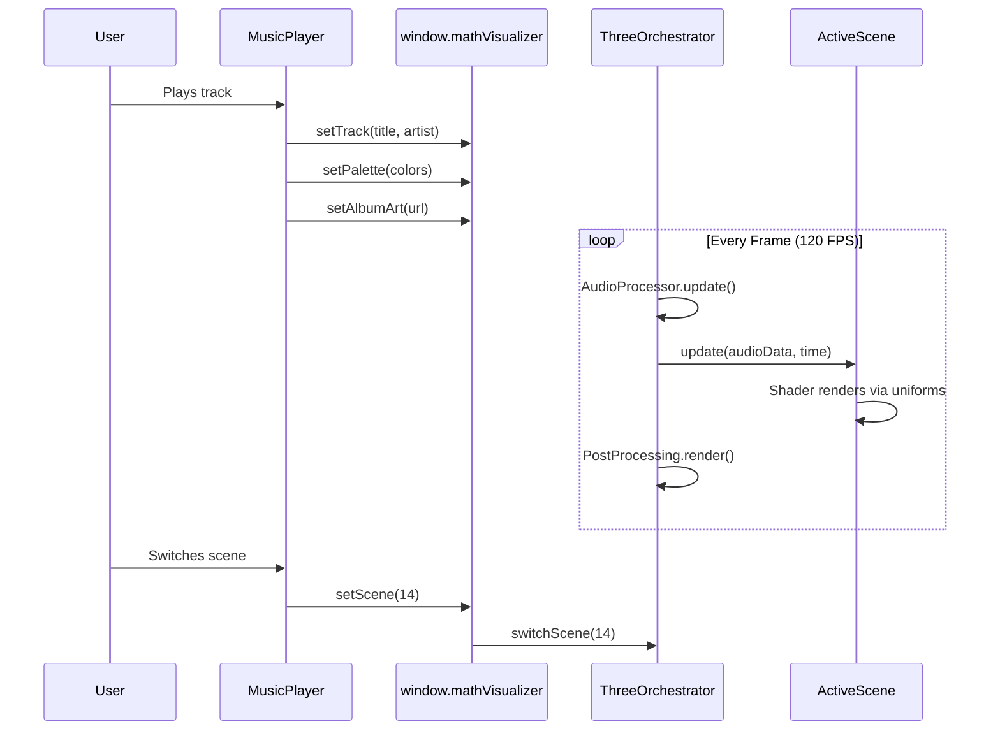

# Player Integration Guide

> How the visualizer connects to the MusicPlayer UI

---

## Bridge API

The visualizer exposes itself via `window.mathVisualizer`:

```typescript
interface MathVisualizerAPI {
  setTrack(title: string, artist: string): void;
  setPalette(colors: [string, string, string]): void;
  setScene(index: number): void;
  setUiVisible(visible: boolean): void;
  setAlbumArt(imageUrl: string): void;
  destroy(): void;
}
```

---

## Initialization

```javascript
// In MusicPlayer.js
import('../visualizer/main.js').then(({ ThreeOrchestrator }) => {
  const container = document.getElementById('mathVisualizerContainer');
  const analyser = audioContext.createAnalyser();
  
  window.mathVisualizer = new ThreeOrchestrator({
    analyser,
    container,
    resolutionScale: 1.0
  });
});
```

---

## DOM Structure

```html
<div id="mathVisualizerContainer">
  <!-- ThreeOrchestrator injects canvas here -->
  <canvas style="position: absolute; inset: 0; z-index: 0;"></canvas>
</div>
```

The canvas is positioned absolutely behind all UI elements.

---

## Scene Switching

The MusicPlayer UI renders scene buttons with `data-gpu-scene` attributes:

```html
<button class="preset-picker-option" data-gpu-scene="0">Lava Flow</button>
<button class="preset-picker-option" data-gpu-scene="1">Julia Set 4D</button>
<!-- ... -->
<button class="preset-picker-option" data-gpu-scene="16">Fractal Optic Fibre</button>
```

Click handler:
```javascript
button.addEventListener('click', () => {
  const sceneId = parseInt(button.dataset.gpuScene);
  window.mathVisualizer.setScene(sceneId);
  this.settings.gpuScene = sceneId;
});
```

---

## Palette System

Colors are extracted from album art using `ColorEngine`:

```javascript
const palette = ColorEngine.extractPalette(albumArtImage);
// Returns [background, primary, accent] as hex strings

window.mathVisualizer.setPalette(palette);
```

Inside the orchestrator, hex strings convert to `THREE.Color` and propagate to all scenes via `setPalette()`.

---

## Zen Mode

Activated via double-click or keyboard shortcut:

1. Hides all player UI (`opacity: 0`, pointer-events disabled)
2. Visualizer fills entire viewport
3. Typography (track/artist) rendered directly via `GpuTypography`
4. Auto-hide after 3 seconds of inactivity
5. `uiToggle` custom event dispatched for coordination

---

## Resolution Scaling

For performance on different hardware:

| Scale | Effective Resolution | Use Case |
|-------|---------------------|----------|
| 0.5 | 960×540 (1080p display) | Battery saving |
| 0.75 | 1440×810 | Balanced |
| 1.0 | Native | Default |
| 1.5 | 2880×1620 (1080p display) | Quality mode |
| 2.0 | 3840×2160 | Screenshot mode |

Applied via `renderer.setPixelRatio(scale * devicePixelRatio)`.

---

## Event Flow



